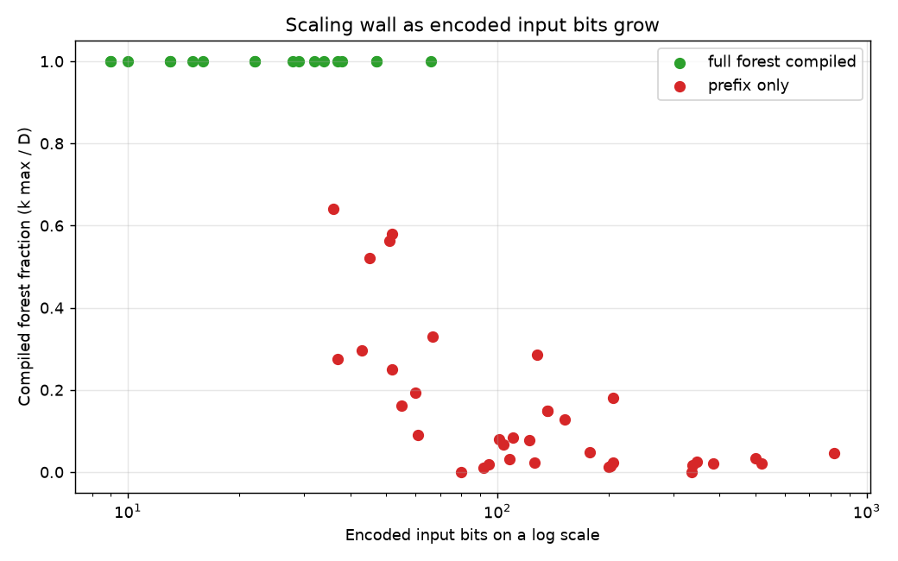
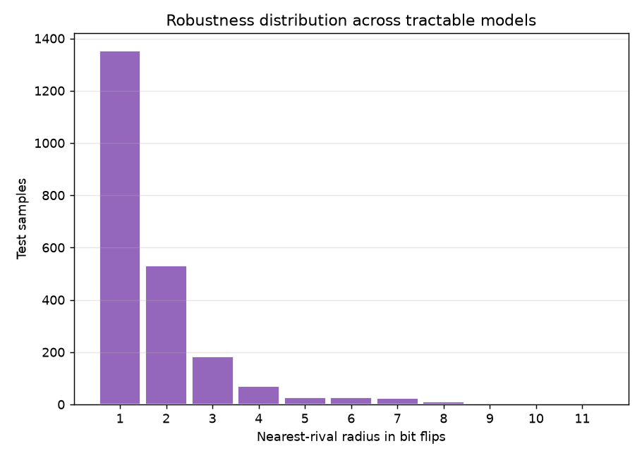
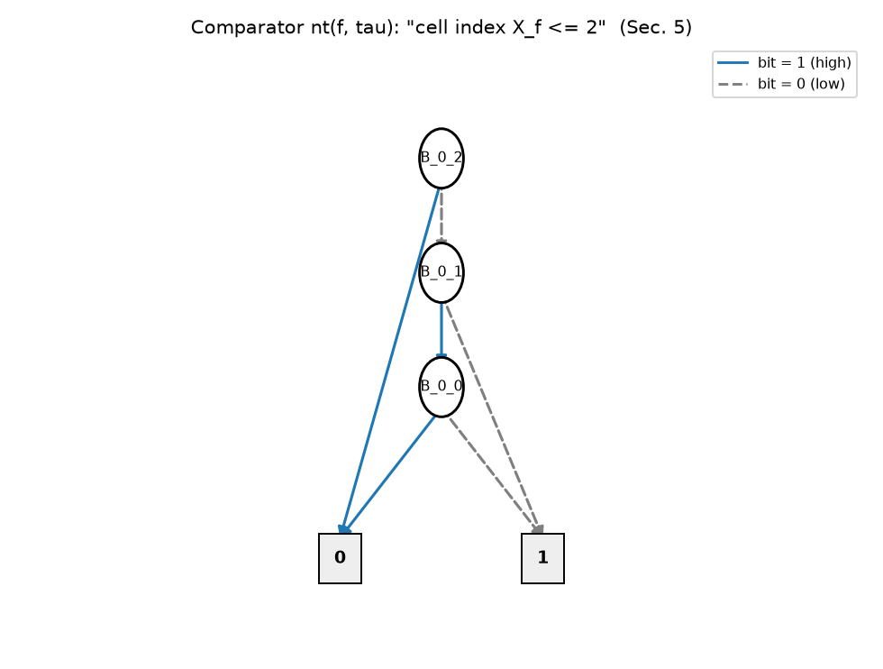

# obdd-random-forest-robustness

> Compiling trained random forests into ordered binary decision diagrams to certify what they predict on every possible input, and to measure how many bit flips separate a real test sample from a different certified class.

    

BDSS 2025/26 course project, University of Verona.  
Author: Francesco Simbola

---

## The Question

A random forest scores well on its test set. That number says nothing about the inputs nobody tested, and nothing about how close a correctly classified sample sits to a different answer.

This project compiles the whole forest into an OBDD that represents, for every possible input, the class the forest is guaranteed to predict. On that diagram three questions become single passes over the nodes: how many inputs each class wins with a guarantee, which input bits drive the outcome, and how many bits a given test sample has to flip before the certified class changes.

Short answer: exact certification works for forests with a compact input encoding, and the number of encoded input bits limits it far more than the number of trees does. On more than half of the models that could be analysed, the median certified test sample sits one bit flip away from a different certified class.

---

## Results

The study covers the 54 tuned forests provided with the assignment.

| Property | Result | Interpretation |
|---|---:|---|
| Models | 54 forests, up to 100 trees, depth 3 to 10, 2 to 26 classes | Tuned scikit-learn models, treated as fixed objects |
| Encoded input size | 9 to 816 bits, median 66 | Each feature becomes a short binary cell index |
| Full compilation | 18 of 54 | Every fully compiled forest has at most 66 input bits |
| Partial compilation | 34 of 54 | The failing tree prefix is pinned to an adjacent pair, e.g. ann-thyroid compiles 9 of 100 trees and fails at 10 |
| No compilable prefix | 2 of 54 | `letter` (26 classes) and `texture` (11 classes) |
| Grid campaign | 3,668 configurations, 2,329 completed | 54 models, 3 budgets, 5 split selectors, growing tree prefixes |
| Robustness coverage | 50 of 54 models, 2,304 test samples, 2,229 certified | `factors` and `karhunen` exceed the 600 s limit |
| Median robustness radius | 1 to 6 bit flips per model, exactly 1 on 29 models | Many certified predictions sit right next to a decision boundary |
| Validation | 110 tests, 1,536 of 1,536 exhaustive checks | Every step is checked against an independent oracle |



Green points compile the whole forest, red points stop at a prefix. The separation runs along the horizontal axis, the number of encoded input bits.

### Node budget

When a diagram grows past a node budget B, the input space is split into slices that are compiled separately. On the 250 configurations that all three budgets completed with at least one split:

| Budget B | Slices (median) | Peak nodes (median) | Runtime (median) |
|---:|---:|---:|---:|
| 1,000 | 142 | 1,779 | 4.30 s |
| 10,000 | 1 | 10,269 | 0.92 s |
| 100,000 | 1 | 11,584 | 0.77 s |

A tight budget keeps every diagram small but repeats the work over many slices. A medium budget removes most of that repetition.

### Split selectors

The five split rules only matter when a split happens, so the comparison uses the 101 configurations that all five completed with at least one split.

| Selector | Slices (median) | Runtime (median) | Completion rate |
|---|---:|---:|---:|
| `modal_var` | 9 | 3.33 s | 65% |
| `shapley` | 21 | 8.72 s | 62% |
| `infogain` | 21 | 7.16 s | 63% |
| `pvalue` | 21 | 7.16 s | 63% |
| `random_node` | 21 | 11.30 s | 64% |

### Robustness



The radius of a certified test sample is the smallest number of encoded bits that must flip before the forest certifies a rival class. Each sample counts once, and the 75 samples without a certificate stay out of the distribution. A second measure, the escape distance, counts the flips needed to lose the certificate without requiring any rival to win. It is strictly smaller than the rival radius for 329 samples and lowers the median in 8 of the 50 models, so losing a certificate and handing it to a rival are different events in practice.

### Readouts

On `iris` (16 input bits, 65,536 possible inputs) the forest certifies 56,144 inputs, 85.7% of the space: 7,118 for Setosa, 19,898 for Versicolor and 29,128 for Virginica. Shapley values and p-values both rank the petal-width bits first. Information gain promotes a sepal-width bit instead, because it rewards splitting the space evenly rather than deciding the outcome.

---

## Why the Wall Follows Input Bits

The input bits are the variables of the final diagram. The trees are processed one at a time, and after each tree its intermediate vote state is quantified away, so a new tree adds work without adding permanent variables. A 75-tree forest with a 10-bit encoding (`mofn-3-7-10`) compiles completely, while `pima` with 16 trees and 51 bits stops at 9 trees. Every forest above 66 bits stops at a prefix.

## Why the Cheapest Selector Wins

The three semantic selectors score each input bit on the set of certified inputs. During compilation, though, most of the diagram's size lives in the vote counters, which those scores never see. A bit that splits the certified inputs evenly can leave the diagram as large as before. `modal_var` picks the variable that labels the most nodes, so it attacks the size directly. The assignment warns that no semantic criterion is guaranteed to help, and the data agree.

---

## How It Works

1. **Discretisation.** Every threshold a forest tests on a feature is collected and sorted. The intervals between consecutive thresholds are cells, and two values in the same cell are treated identically by every tree. This was checked against `sklearn` on full datasets.
2. **Binary encoding.** Each cell index is written with `ceil(log2(cells))` bits, never one variable per cell. A node test "x ≤ threshold" becomes a comparator on those bits whose size grows linearly with the number of bits.
3. **Vote counting.** Every class gets a binary counter. A class clinches when its lead over every rival is at least the number of trees still to vote. This certifies the winner that is guaranteed whatever the remaining trees do. For two classes it matches the majority vote. For three or more it is sound but deliberately incomplete: the votes A, A, A, B, C, B, C elect A, yet A never leads beyond doubt.
4. **Composition.** The per-tree rules are chained through a relational product that keeps only two copies of the state alive. The result is one diagram per class over the input bits alone.
5. **Budgeted frontier.** When the diagram exceeds B nodes, one input bit is fixed to 0 and to 1 and each half continues separately. The slices partition the input space, so counts add up exactly.
6. **Readouts.** Model counting, weighted volume, Shapley values through zero-stratified polynomials and hypergeometric p-values all share one memoised bottom-up pass over the diagram.
7. **Robustness.** The same pass with (min, +) in place of (+, ×) computes the Hamming distance from a sample to a certified region. Walking back down the cheapest branches returns the witness, the exact bits to flip.



The comparator for "cell index ≤ 2" on a three-bit feature. Solid edges set a bit to 1, dashed edges to 0.

### Worked Example

Row 0 of the `iris` test split (sepal 4.4 × 3.0, petal 1.3 × 0.2) lands in cells (0, 5, 0, 0) of a 16-bit encoding. All 26 trees vote Setosa, and the class clinches well before the last tree (W = 14). Its radius is 0 toward Setosa and 2 toward each rival. Toward Versicolor the witness moves sepal width to (2.45, 2.55] and petal length to (4.45, 4.55].

---

## Interactive Visualisation

`results/figures/obdd/index_obdd.html` links 20 interactive OBDDs, one for each model whose diagram is small enough to read. Each page is self-contained, with the diagram data embedded and no external scripts:

- nodes coloured by feature, with the real threshold intervals on click;
- pan and zoom;
- works offline.

Download the folder and open `index_obdd.html` in a browser.

---

## Tech Stack

- **Language**: Python 3.12
- **Decision diagrams**: `dd` 0.6.0. The code prefers the CUDD backend and falls back to the pure-Python `dd.autoref` when CUDD is not installed.
- **Models and data**: scikit-learn 1.4.2, joblib, NumPy, pandas, SciPy
- **Figures**: matplotlib
- **Testing**: pytest

---

## Project Structure

```text
.
|-- src/obddrf/
|   |-- discretize.py        # Thresholds, cells and binary cell encoding
|   |-- comparator.py        # Node test "x <= threshold" as a bit comparator
|   |-- counters.py          # Vote counters, clinch predicate, per-tree rule
|   |-- compose.py           # Variable order, tree composition, Win regions
|   |-- readouts.py          # Generic bottom-up pass: counts, volume, Shapley, p-values
|   |-- selectors.py         # The five split selectors
|   |-- frontier.py          # Budgeted frontier of slices
|   |-- robustness.py        # Min-plus radius, witness, escape distance
|   |-- forest_io.py         # Model loading and label-encoding validation
|   |-- bdd_backend.py       # CUDD when available, dd.autoref otherwise
|   |-- config.py            # Study parameters with their rationale
|   `-- experiments/         # Grid campaign, robustness and readout batches, figures
|-- tests/                   # One oracle file per pipeline phase (110 tests)
|-- results/                 # Campaign CSVs, per-model robustness and readouts, figures
|-- datasets/datasets/       # The 54 datasets with their tuned models
|-- report.pdf               # Full project report
|-- INTERFACES.md            # Shared data structures between modules
|-- requirements.txt
`-- pyproject.toml
```

---

## Installation

Python 3.12 is required. The models were saved with scikit-learn 1.4.2 and NumPy 1.x, and both versions are pinned in `requirements.txt`.

```bash
git clone https://github.com/francesco-univr/obdd-random-forest-robustness.git
cd obdd-random-forest-robustness
python -m venv .venv
```

Activate the environment, then install the dependencies and the package:

```bash
pip install -r requirements.txt
pip install -e .
```

## Quickstart

Run the test suite first. If it passes, every phase of the pipeline agrees with its oracle.

```bash
python -m pytest
```

Robustness of the `iris` test set, printed to the terminal:

```bash
python -m obddrf.experiments.run_robustness --dataset iris
```

The same on another model, choosing tree prefix, budget and selector:

```bash
python -m obddrf.experiments.run_robustness --dataset banknote --trees 20 --budget 10000 --selector modal_var
```

## Reproducing the Study

Run the commands in this order. The grid comes first because robustness, readouts and figures read its CSV. The grid campaign takes a few hours. Grid, robustness and readouts accept `--resume`, so a run can be interrupted and restarted with the same command. Lower `--jobs` to 2 on machines with little RAM.

```bash
python -m obddrf.experiments.datasets_overview
python -m obddrf.experiments.run_grid --selectors infogain shapley pvalue random_node modal_var --locate-wall --jobs 4 --resume --out results/grid_campagna.csv
python -m obddrf.experiments.analyze_grid results/grid_campagna.csv
python -m obddrf.experiments.run_robustness_batch --max-samples 50 --timeout 600 --jobs 4
python -m obddrf.experiments.run_readouts --jobs 4 --resume
python -m obddrf.experiments.make_figures
```

All parameters live in `src/obddrf/config.py`, each with the reason it was chosen. They come from a calibration run whose results are kept in `results/grid_calibrazione.csv`.

---

## Dataset

The 54 datasets were provided with the course assignment and are stored in `datasets/datasets/<name>/`. Each folder holds the train and test splits as CSV, the tuned `RandomForestClassifier` saved with joblib together with its hyperparameters and accuracies, and the Optuna tuning results. The models must be loaded with `joblib.load`, not `pickle.load`.

---

## Key Learnings

1. **Keep a slow reference implementation next to the fast one.** The array-based robustness route runs 21 times faster than walking live diagram objects (749 s down to 35 s on `wdbc`). An early version ignored the complemented edges of the `dd` library and returned a radius of 0 where the correct answer was infinite. The disagreement with the slow route exposed it, and a regression test now compares both on a real model.

2. **Split decisions should target diagram size, not the semantics of the inputs.** The selector that reads the shape of the diagram beat the three statistically motivated ones, because the size lives in state variables the semantic scores cannot see.

3. **Check the artefacts, not only the status codes.** A subprocess sent every result row back through a pipe while the parent waited for it to exit. The pipe filled up, and 14 completed robustness runs were logged as timeouts. Cross-checking the summary against the per-model files recovered all of them, and the worker now sends a single summary row.

4. **Aggregate per sample before computing statistics.** A per-row flag counted a sample twice whenever two rivals tied at the same distance, which inflated the one-flip bin. Deduplicating per sample and using the statistical median changed several per-model medians.

---

## Limitations

- The experiments ran on the pure-Python `dd.autoref` backend because CUDD cannot be built on the Windows machine used. CUDD would push the walls further, and the code switches to it automatically when it is installed.
- For three or more classes the certificate is sound but incomplete by design, since only guaranteed winners are certified.
- The forest of the assignment votes with hard leaf labels, while `sklearn`'s `predict` averages tree probabilities. The two rules disagree on 504 of 37,950 test samples. Separately, `sklearn` casts inputs to 32-bit floats, which changes the hard vote on 5 samples.
- The weighted volume is the uniform measure over bit patterns, not a geometric volume.
- The readout batch compiles the monolithic diagram, so it covers 33 of the 54 models.
- The radius counts flips in the binary encoding, not distance in the original feature units, and each model contributes up to 50 test samples.

---

## References

- P. Sala, *Project Assignment 2026: Robustness of a Random-Forest Classifier*, BDSS 2025/26, University of Verona, 2026.
- R. E. Bryant, *Graph-Based Algorithms for Boolean Function Manipulation*, IEEE Transactions on Computers, 1986.
- L. S. Shapley, *A Value for n-Person Games*, Contributions to the Theory of Games II, 1953.
- F. Pedregosa et al., *Scikit-learn: Machine Learning in Python*, JMLR, 2011.
- The `dd` package for binary decision diagrams: https://github.com/tulip-control/dd

Full discussion and methodology are in [`report.pdf`](report.pdf).
